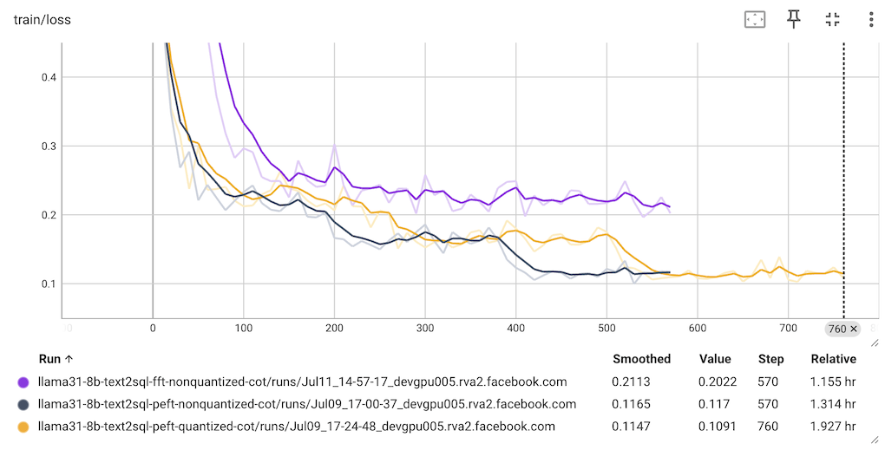

# Enhancing Text-to-SQL with CoT: A Fine-Tuning Approach with Llama

This folder contains scripts to:

* generate a dataset from the BIRD TRAIN set (with no CoT info) for supervised fine-tuning (SFT);
* generate a dataset from the BIRD TRAIN set (with CoT info by Llama 3.3 70B) for SFT;
* SFT the Llama 3.1 8B model with the generated datasets with different fine-tuning combinations: with or without CoT, using quantization or not,  full fine-tuning (FFT) or parameter-efficient fine-tuning (PEFT).

**Note:** CoT stands for Chain of Thought and we will use "CoT" and "reasoning" interchangeably here, although generally, reasoning encompasses a broader concept than CoT.

## Eval Results of the Fine-tuned Models

The eval results of SFT Llama 3.1 8B with different options (epochs is 3, with an additional 10 for the two FFT models) are summarized below:

| Fine-tuning Combination     | Accuracy                      |
|-----------------------------|-------------------------------|
| baseline                    | 39.47%                        |
| CoT, PEFT                   | 43.35%                        |
| CoT, FFT                    | 42.44% (3 epochs)             |
| CoT, FFT                    | 43.87% (10 epochs)            |


Using Quantization+PEFT on CoT dataset only dropped the accuracy from 43.35% to 42.89%.

## Creating dataset

We use the BIRD TRAIN dataset to prepare for supervised fine-tuning with reasoning info in the dataset. The goal is to see if we can improve the accuracy of the fine-tuned model by adding the reasoning info in the dataset.

### Creating a reasoning dataset from the TRAIN dataset

The script `create_reasoning_dataset.py` is used to create a reasoning dataset from the TRAIN dataset by asking Llama 3.3 70B to generate the reasoning for each text question and its corresponding gold SQL. The intent is to use the reasoning dataset to fine-tune the Llama model to improve the accuracy of the generated SQL.

To run the script, use the following commands:
```
python create_reasoning_dataset.py --input_json ../data/train/train.json --db_root_path ../data/train/train_databases
```

This will create a `text2sql_cot_dataset` dataset and `train_text2sql_cot_dataset.json` in the conversation format ready for fine-tuning. Each example in the dataset is generated from the code snippet below:

```
prompt = f"""
-- DB Schema: {db_schema}
-- External Knowledge: {external_knowledge}
-- Text Question: {question}
"""
cot = {
    "messages": [
        {
            "role": "system",
            "content": "You are a text to SQL query translator. Using the SQLite DB Schema and the External Knowledge, generate the step-by-step reasoning and the final SQLite SQL select statement from the text question.",
        },
        {"role": "user", "content": prompt},
        {"role": "assistant", "content": reasoning},
    ]
}
```

The prompt for Llama 3.3 70B to generate the `reasoning` above is:
```
You are a text to SQL query translator. Based on the DB Schema and External Knowledge, given the Text Question Input and its Gold SQL Output below, generate the step-by-step reasoning to infer the Gold SQL Output from the Text Question Input.

-- DB Schema: {db_schema}
-- External Knowledge: {external_knowledge}
-- Text Question Input: {question}
-- Gold SQL Output: {gold_SQL}

Your response should be as follows:\n\n
Let me think through this step by step:\n\n1. First, I need to consider...\n2. Then...\n3. Next...\n...\n\nFinally, the SQL statement for the text question is:
```sql ...```\n

"""
```

### Running fine-tuning

Run one of the commands below:

```
python trl_sft.py --quantized false --peft false --cot true
python trl_sft.py --quantized false --peft true --cot true
python trl_sft.py --quantized true --peft true --cot true
```

After the fine-tuning completes, you'll see the fine-tuned model saved in one of the following folders, as specified in `output_dir` of `SFTConfig` in `trl_sft.py`:

```
llama31-8b-text2sql-fft-nonquantized-cot
llama31-8b-text2sql-peft-nonquantized-cot
llama31-8b-text2sql-peft-quantized-cot
```

The train loss chart should look like this:


### Evaluating the fine-tuned model

1. Set the `model` value in `llama_eval.sh` to be one of the fine-tuned model folders above, e.g.

```
YOUR_API_KEY='finetuned'
model='fine_tuning/llama31-8b-text2sql-fft-nonquantized-cot'
```

2. Uncomment the line `SYSTEM_PROMPT` [here](https://github.com/meta-llama/llama-cookbook/blob/text2sql/end-to-end-use-cases/coding/text2sql/eval/llama_text2sql.py#L17) in `llama_text2sql.py` to use it with the reasoning dataset fine-tuned model.

3. Start the vllm server by running
```
vllm serve fine_tuning/llama31-8b-text2sql-fft-nonquantized-cot --tensor-parallel-size 1 --max-num-batched-tokens 8192 --max-num-seqs 64
```
If you have multiple GPUs you can run something like 
```
CUDA_VISIBLE_DEVICES=0,1,2,3,4,5,6,7 vllm serve fine_tuning/llama31-8b-text2sql-fft-nonquantized-cot --tensor-parallel-size 8 --max-num-batched-tokens 8192 --max-num-seqs 64
```
 to speed up the eval.

4. Run `sh llama_eval.sh`.

**Note:** If your fine-tuned model is PEFT based, you may need to run `python merge_peft.py` after modifying its `peft_model_path` and `output_dir` and set the merged folder path after `vllm serve`.
