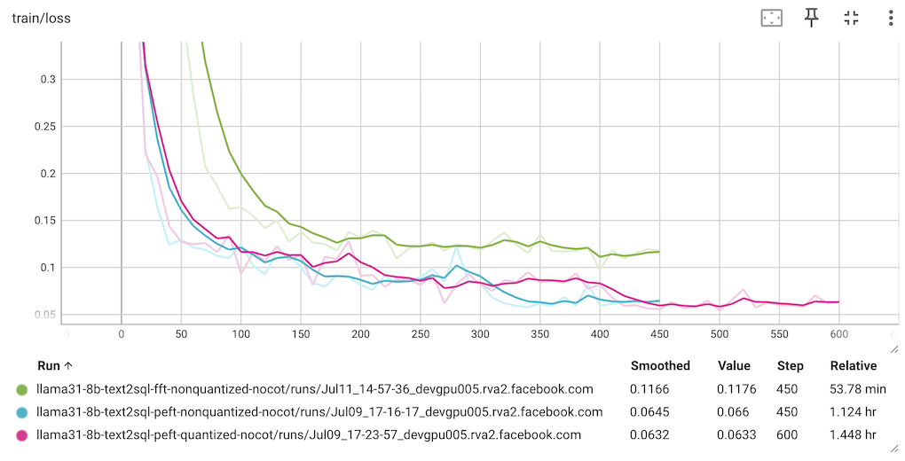

# Enhancing Text-to-SQL with CoT: A Fine-Tuning Approach with Llama

This folder contains scripts to:

* generate a dataset from the BIRD TRAIN set (with no CoT info) for supervised fine-tuning (SFT);
* generate a dataset from the BIRD TRAIN set (with CoT info by Llama 3.3 70B) for SFT;
* SFT the Llama 3.1 8B model with the generated datasets with different fine-tuning combinations: with or without CoT, using quantization or not,  full fine-tuning (FFT) or parameter-efficient fine-tuning (PEFT).

**Note:** CoT stands for Chain of Thought and we will use "CoT" and "reasoning" interchangeably here, although generally, reasoning encompasses a broader concept than CoT.

## Eval Results of the Fine-tuned Models

The eval results of SFT Llama 3.1 8B with different options (epochs is 3) are summarized in the table below:

| Fine-tuning Combination     | Accuracy |
|-----------------------------|----------|
| Non-Quantized, CoT, PEFT    | 43.35%   |
| Quantized, CoT, PEFT        | 42.89%   |
| Non-Quantized, No CoT, PEFT | 39.31%   |
| Quantized, No CoT, PEFT     | 39.31%   |
| Non-Quantized, CoT, FFT     | 38.46%   |
| Non-Quantized, No CoT, FFT  | 33.70%   |
| Quantized, CoT, FFT         | N/A      |
| Quantized, No CoT, FFT      | N/A      |

## SFT with the BIRD TRAIN dataset (No Reasoning)

We'll first use the BIRD TRAIN dataset to prepare for supervised fine-tuning with no reasoning info in the dataset.

### Using the TRAIN to prepare for supervised fine-tuning

1. Get the TRAIN dataset:
```
cd data
sh download_train_unzip.sh
```

2. Create the dataset

```
cd ../fine_tuning
python create_sft_dataset.py --input_json ../data/train/train.json --db_root_path ../data/train/train_databases
```

This will create `train_text2sql_sft_dataset.json` and `test_text2sql_sft_dataset.json` using the TRAIN set. Each line in the json files is in the conversation format ready for fine-tuning:

```
{"messages":[{"content":"You are a text to SQL query translator. Using the SQLite DB Schema and the External Knowledge, translate the following text question into a SQLite SQL select statement.","role":"system"},{"content":"-- DB Schema: <DB_SCHEMA>\n\n-- External Knowledge: <KNOWLEDGE_FROM_TRAIN>\n\n-- Question: <TEXT_QUESTION>","role":"user"},{"content":"<GOLD_SQL>","role":"assistant"}]}
```

### SFT (No Reasoning)

First, you need to login to HuggingFace (via running `huggingface-cli login` and enter your [HF token](https://huggingface.co/settings/tokens)) and have been granted access to the [Llama 3.1 8B Instruct](https://huggingface.co/meta-llama/Llama-3.1-8B-Instruct) model.

Then run one of the commands below (`trl_sft.py` has three command line parameters: `--quantized`, `--peft`, and `--cot`, all with true or false values):

```
python trl_sft.py --quantized false --peft true --cot false
python trl_sft.py --quantized false --peft false --cot false
python trl_sft.py --quantized true --peft true --cot false
```

Note that we don't recommend using the quantized version with FFT (--peft false).


After the fine-tuning completes, you'll see the fine-tuned model saved in one of the following folders, as specified in `output_dir` of `SFTConfig` in `trl_sft.py`:

```
llama31-8b-text2sql-fft-nonquantized-nocot
lama31-8b-text2sql-peft-nonquantized-nocot
llama31-8b-text2sql-peft-quantized-nocot
```

After running `tensorboard --logdir ./llama31-8b-text2sql-fine_tuning` you can open `http://localhost:6006` to see the train loss chart like this:




### Evaluating the fine-tuned model (No Reasoning)

First, set the `model` value in `llama_eval.sh` to be one of the fine-tuned model folders above, e.g.

```
YOUR_API_KEY='finetuned'
model='fine_tuning/llama31-8b-text2sql-fft-nonquantized-nocot'
```

Then run `sh llama_eval.sh` to evaluate the fine-tuned model. The accuracy on the BIRD DEV dataset is about 37.16%. This is a 165% improvement over the model before fine-tuning, which has an accuracy of about 14.02% on the same dataset - you can confirm this by comparing the fine-tuned model's accuracy above with the original model's accuracy by modifying `llama_eval.sh` to use the original model:

```
YOUR_API_KEY='huggingface'
model='meta-llama/Llama-3.1-8B-Instruct'
```

Then running `sh llama_eval.sh` to evaluate the original model.


## SFT with the BIRD TRAIN dataset (With Reasoning)

Next we'll use the BIRD TRAIN dataset to prepare for supervised fine-tuning with reasoning info in the dataset. The goal is to see if we can improve the accuracy of the fine-tuned model by adding the reasoning info in the dataset.

### Creating a reasoning dataset from the TRAIN dataset

The script `create_reasoning_dataset.py` is used to create a reasoning dataset from the TRAIN dataset by asking Llama 3.3 70B to generate the reasoning for each text question and its corresponding gold SQL. The intent is to use the reasoning dataset to fine-tune the Llama model to improve the accuracy of the generated SQL.

To run the script, use the following commands:
```
python create_reasoning_dataset.py --input_json ../data/train/train.json --db_root_path ../data/train/train_databases
```

This will create a `text2sql_cot_dataset` dataset and `train_text2sql_cot_dataset.json` in the conversation format ready for fine-tuning. Each example in the dataset is generated from the code snippet below:

```
prompt = f"""
-- DB Schema: {db_schema}
-- External Knowledge: {external_knowledge}
-- Text Question: {question}
"""
cot = {
    "messages": [
        {
            "role": "system",
            "content": "You are a text to SQL query translator. Using the SQLite DB Schema and the External Knowledge, generate the step-by-step reasoning and the final SQLite SQL select statement from the text question.",
        },
        {"role": "user", "content": prompt},
        {"role": "assistant", "content": reasoning},
    ]
}
```

The prompt for Llama 3.3 70B to generate the `reasoning` above is:
```
You are a text to SQL query translator. Based on the DB Schema and External Knowledge, given the Text Question Input and its Gold SQL Output below, generate the step-by-step reasoning to infer the Gold SQL Output from the Text Question Input.

-- DB Schema: {db_schema}
-- External Knowledge: {external_knowledge}
-- Text Question Input: {question}
-- Gold SQL Output: {gold_SQL}

Your response should be as follows:\n\n
Let me think through this step by step:\n\n1. First, I need to consider...\n2. Then...\n3. Next...\n...\n\nFinally, the SQL statement for the text question is:
```sql ...```\n

"""
```

### SFT (With Reasoning)

Run one of the commands below:

```
python trl_sft.py --quantized false --peft true --cot true
python trl_sft.py --quantized false --peft false --cot true
python trl_sft.py --quantized true --peft true --cot true
```

Again we don't recommend using the quantized version with FFT.

After the fine-tuning completes, you'll see the fine-tuned model saved in one of the following folders, as specified in `output_dir` of `SFTConfig` in `trl_sft.py`:

```
llama31-8b-text2sql-fft-nonquantized-cot
lama31-8b-text2sql-peft-nonquantized-cot
llama31-8b-text2sql-peft-quantized-cot
```

The train loss chart should look like this:


### Evaluating the fine-tuned model (With Reasoning)

First, set the `model` value in `llama_eval.sh` to be one of the fine-tuned model folders above, e.g.

```
YOUR_API_KEY='finetuned'
model='fine_tuning/llama31-8b-text2sql-fft-nonquantized-cot'
```

Then uncomment the line `SYSTEM_PROMPT` [here](https://github.com/meta-llama/llama-cookbook/blob/text2sql/end-to-end-use-cases/coding/text2sql/eval/llama_text2sql.py#L31) in `llama_text2sql.py` to use it with the reasoning dataset fine-tuned model.

Now run `sh llama_eval.sh`, which will take longer because the reasoning is needed to generate the SQL. The accuracy this time is 43.37%, compared with 37.16% without reasoning. This is another 16% improvement over the model with fine-tuning without reasoning.
