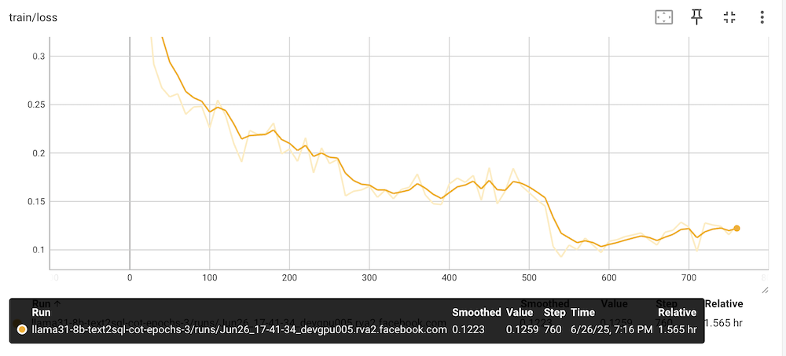

# Text2SQL Evaluation and Fine-Tuning Tools for Llama Models

## Overview

This folder contains scripts to:
1. Evaluate Llama (original and fine-tuned) models on the Text2SQL task using the popular [BIRD](https://bird-bench.github.io) dataset;
2. Generate fine-tuning datasets (with and without reasoning steps)and fine-tuning Llama 3.1 8B with the datasets, gaining a **165% (with no reasoning) and 209% (with reasoning) accuracy improvement** over the original model.

Our end goal is to maximize the accuracy of Llama models on the Text2SQL task via fine-tuning, agent and other approaches. To do so we need to first evaluate the current state of the art Llama models on the task. In other words, "no eval, no success" AND "eval only is not success". Hence, we have created this tool to quickly evaluate Llama models on the Text2SQL task and, as a first step, to fine-tune Llama models to improve their accuracy on the task.

## Llama Text2SQL Evaluation

We have updated and significantly simplified the original eval scripts from the BIRD [repo](https://github.com/AlibabaResearch/DAMO-ConvAI/tree/main/bird) for Llama 3 & 4 models hosted via Meta's [Llama API](https://llama.developer.meta.com) or [Together.ai](https://together.ai), as well as the fine-tuned Llama 3.1 model, so you can quickly evaluate in 1-2-3 steps how well different Llama models perform on the Text2SQL task.

### Evaluation Results

Below are the results of the Llama models we have evaluated on the BIRD DEV dataset:

| Model                  | Llama API Accuracy | Together Accuracy |
|------------------------|--------------------|-------------------|
| Llama 3.1 8b           | -                  | 35.66%            |
| Llama 3.3 70b          | 54.11%             | 54.63%            |
| Llama-3.1-405B         | -                  | 55.80%            |
| Llama 4 Scout          | 44.39%             | 43.94%            |
| Llama 4 Maverick       | 44.00%             | 41.46%            |

- Llama 3.1 8b quantized model: 14.02% (original)
- Fine-tuned with no reasoning dataset: 37.16%
- Fine-tuned with reasoning dataset: 43.37%

### Quick Start on Evaluating Llama on Text2SQL

First, run the commands below to create a new Conda environment and install all the required packages for Text2SQL evaluation and fine-tuning:

```
git clone https://github.com/meta-llama/llama-cookbook
cd llama-cookbook/end-to-end-use-cases/coding/text2sql/tool
conda create -n llama-text2sql python=3.10
conda activate llama-text2sql
pip install -r requirements.txt
```

Then, follow the steps below to evaluate Llama 3 & 4 models on Text2SQL using the BIRD benchmark:

1. Get the DEV dataset:
```
cd data
sh download_dev_unzip.sh
```

2. Open `llama_eval.sh` and set `YOUR_API_KEY` to your [Llama API](https://llama.developer.meta.com/) key or [Together](https://api.together.ai/) API key, then uncomment a line that starts with `model=` to specify the Llama model to use for the text2sql eval.

3. Run the evaluation script `sh llama_eval.sh`, which will use the BIRD DEV dataset (1534 examples in total) with external knowledge turned on to run the Llama model on each text question and compare the generated SQL with the gold SQL.

If your API key or model name is incorrect, the script will exit with an authentication or model not supported error.

After the script completes, you'll see the accuracy of the Llama model on the BIRD DEV text2sql. For example, the total accuracy is about 54.24% with `YOUR_API_KEY` set to your Llama API key and `model='Llama-3.3-70B-Instruct'`, or about 35.07% with `YOUR_API_KEY` set to your Together API key and `model=meta-llama/Meta-Llama-3.1-8B-Instruct-Turbo`.

To compare your evaluated accuracy of your selected Llama model with other results in the BIRD Dev leaderboard, click [here](https://bird-bench.github.io/).

### Evaluation Process

1. **SQL Generation**: `llama_text2sql.py` sends natural language questions to the specified Llama model and collects the generated SQL queries.

2. **SQL Execution**: `text2sql_eval.py` executes both the generated SQL and ground truth SQL against the corresponding databases, then continues with steps 3 and 4 below.

3. **Result Comparison**: The results from executing the generated SQL are compared ([source code](text2sql_eval.py#L30)) with the results from the ground truth SQL to determine correctness.

4. **Accuracy Calculation**: Accuracy scores are calculated overall and broken down by difficulty levels (simple, moderate, challenging).

### Supported Models for Evaluation

Llama models supported on Together AI:
- meta-llama/Meta-Llama-3.1-8B-Instruct-Turbo
- meta-llama/Llama-3.3-70B-Instruct-Turbo
- meta-llama/Llama-4-Maverick-17B-128E-Instruct-FP8
- meta-llama/Llama-4-Scout-17B-16E-Instruct
- other Llama models hosted on Together AI

Llama models supported on Llama API:
- Llama-3.3-8B-Instruct
- Llama-3.3-70B-Instruct
- Llama-4-Maverick-17B-128E-Instruct-FP8
- Llama-4-Scout-17B-16E-Instruct-FP8
- other Llama models hosted on Llama API

## Fine-tuning with the BIRD TRAIN dataset (No Reasoning)

We'll first use the BIRD TRAIN dataset to prepare for supervised fine-tuning with no reasoning info in the dataset.

### Using the TRAIN to prepare for supervised fine-tuning

1. Get the TRAIN dataset:
```
cd data
sh download_train_unzip.sh
```

2. Create the dataset

```
cd fine_tuning
python create_sft_dataset.py --input_json ../data/train/train.json --db_root_path ../data/train/train_databases
```

This will create `train_text2sql_sft_dataset.json` and `test_text2sql_sft_dataset.json` using the TRAIN set. Each line in the json files is in the conversation format ready for fine-tuning:

```
{"messages":[{"content":"You are a text to SQL query translator. Using the SQLite DB Schema and the External Knowledge, translate the following text question into a SQLite SQL select statement.","role":"system"},{"content":"-- DB Schema: <DB_SCHEMA>\n\n-- External Knowledge: <KNOWLEDGE_FROM_TRAIN>\n\n-- Question: <TEXT_QUESTION>","role":"user"},{"content":"<GOLD_SQL>","role":"assistant"}]}
```

### Supervised Fine-tuning (No Reasoning)

First, you need to login to HuggingFace (via running `huggingface-cli login` and enter your [HF token](https://huggingface.co/settings/tokens)) and have been granted access to the [Llama 3.1 8B Instruct](https://huggingface.co/meta-llama/Llama-3.1-8B-Instruct) model.

Then run `python trl_sft.py`. After the fine-tuning completes, you'll see the fine-tuned model saved to `llama31-8b-text2sql-fine-tuned`, specified in `output_dir="llama31-8b-text2sql-fine-tuned"` of `TrainingArguments` in `trl_sft.py`.

After running `tensorboard --logdir ./llama31-8b-text2sql-fine_tuning` you can open `http://localhost:6006` to see the train loss chat etc:


### Evaluating the fine-tuned model (No Reasoning)

First, modify `llama_eval.sh` to use the fine-tuned model:

```
YOUR_API_KEY='finetuned'
model='fine_tuning/llama31-8b-text2sql'
```

Then run `sh llama_eval.sh` to evaluate the fine-tuned model. The accuracy on the BIRD DEV dataset is about 37.16%. This is a 165% improvement over the model before fine-tuning, which has an accuracy of about 14.02% on the same dataset - you can confirm this by comparing the fine-tuned model's accuracy above with the original model's accuracy by modifying `llama_eval.sh` to use the original model:

```
YOUR_API_KEY='huggingface'
model='meta-llama/Llama-3.1-8B-Instruct'
```

Then running `sh llama_eval.sh` to evaluate the original model.

*Note:* We are using the 4-bit quantized Llama 3.1 8b model to reduce the memory footprint and improve the efficiency (as shown in the code nippet of llama_text2sql.py below), hence the accuracy of the quantized version (14.02%) is quite lower than the accuracy of the original Llama 3.1 8b (35.66%).

```
  bnb_config = BitsAndBytesConfig(
      load_in_4bit=True,
      bnb_4bit_use_double_quant=True,
      bnb_4bit_quant_type="nf4",
      bnb_4bit_compute_dtype=torch.bfloat16,
  )
```

## Fine-tuning with the BIRD TRAIN dataset (With Reasoning)

Next we'll use the BIRD TRAIN dataset to prepare for supervised fine-tuning with reasoning info in the dataset. The goal is to see if we can improve the accuracy of the fine-tuned model by adding the reasoning info in the dataset.

### Creating a reasoning dataset from the TRAIN dataset

The script `create_reasoning_dataset.py` is used to create a reasoning dataset from the TRAIN dataset by asking Llama 3.3 70B to generate the reasoning for each text question and its corresponding gold SQL. The intent is to use the reasoning dataset to fine-tune the Llama model to improve the accuracy of the generated SQL.

To run the script, use the following commands:
```
cd fine_tuning
python create_reasoning_dataset.py --input_json ../data/train/train.json --db_root_path ../data/train/train_databases
```

This will create a `text2sql_cot_dataset` dataset and `train_text2sql_cot_dataset.json` in the conversation format ready for fine-tuning. Each example in the dataset is generated from the code snippet below:

```
prompt = f"""
-- DB Schema: {db_schema}
-- External Knowledge: {external_knowledge}
-- Text Question: {question}
"""
cot = {
    "messages": [
        {
            "role": "system",
            "content": "You are a text to SQL query translator. Using the SQLite DB Schema and the External Knowledge, generate the step-by-step reasoning and the final SQLite SQL select statement from the text question.",
        },
        {"role": "user", "content": prompt},
        {"role": "assistant", "content": reasoning},
    ]
}
```

The prompt for Llama 3.3 70B to generate the `reasoning` above is:
```
You are a text to SQL query translator. Based on the DB Schema and External Knowledge, given the Text Question Input and its Gold SQL Output below, generate the step-by-step reasoning to infer the Gold SQL Output from the Text Question Input.

-- DB Schema: {db_schema}
-- External Knowledge: {external_knowledge}
-- Text Question Input: {question}
-- Gold SQL Output: {gold_SQL}

Your response should be as follows:\n\n
Let me think through this step by step:\n\n1. First, I need to consider...\n2. Then...\n3. Next...\n...\n\nFinally, the SQL statement for the text question is:
```sql ...```\n

"""
```

### Supervised Fine-tuning (With Reasoning)

Uncomment the line `# FT_DATASET = "train_text2sql_cot_dataset.json"` in trl_sft.py to use the reasoning dataset for fine-tuning. Then run `python trl_sft.py`. After the fine-tuning completes, you'll see the fine-tuned model saved to `llama31-8b-text2sql-fine-tuned`, specified in `output_dir="llama31-8b-text2sql-fine-tuned"` of `TrainingArguments` in `trl_sft.py` - you may want to rename the `output_dir` folder to something else to avoid overwriting the previous fine-tuned model.

The train loss chart will look like this:


### Evaluating the fine-tuned model (With Reasoning)

First, modify `llama_eval.sh` to use the fine-tuned model, which should match the `output_dir` in `TrainingArguments` in `trl_sft.py`:

```
YOUR_API_KEY='finetuned'
model='fine_tuning/llama31-8b-text2sql-fine-tuned'
```

Then uncomment the line `SYSTEM_PROMPT` [here](https://github.com/meta-llama/llama-cookbook/blob/text2sql/end-to-end-use-cases/coding/text2sql/tool/llama_text2sql.py#L31) in `llama_text2sql.py` to use it with the reasoning dataset fine-tuned model.

Now run `sh llama_eval.sh`, which will take longer because the reasoning is needed to generate the SQL. The accuracy this time is 43.37%, compared with 37.16% without reasoning. This is another 16% improvement over the model with fine-tuning without reasoning.

## Next Steps
1. Add a Colab notebook for fine-tuning and evaluation.
2. Try reinforcement fine-tuning to improve the accuracy further with reasoning.
3. Use torchtune for full and non-quantized fine-tuning of Llama 3.3 70b and Llama 4 models.
4. Introduce agent to try to improve the accuracy further.
5. Expand the tool to support other databases.
