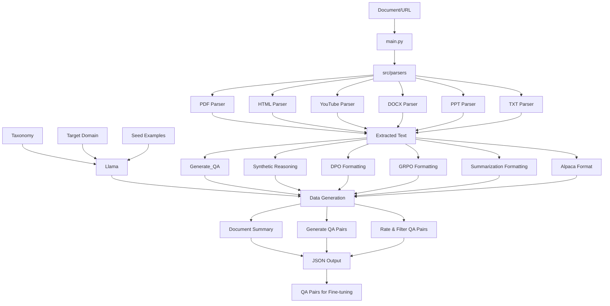

# Data Prep Toolkit

If you are working on fine-tuning a Large Language Model, the biggest effort is usually preparing the dataset. 

## What does this tool do?

This tool contains a bunch of util functions to make your life easy for loading a dataset to torchtune with helpers:
- Parse files: Prepare any file type (list below) to txt
- Convert to prompt response pairs: Convert the txt file to prompt-response pairs
- Filter: Filter out the low quality prompt response pairs
- Fine-tune: Use the pre-defined configs to fine tune a LLM using torchtune

TODO: Add TT links

## Parsers:

(WIP) We support the following file formats for parsing:

- **PDF** - Extracts text from most PDF files (text-based, not scanned)
- **HTML/Web** - Pulls content from local HTML files or any webpage URL
- **YouTube** - Grabs video transcripts (does not transcribe video)
- **Word (DOCX)** - Extracts text, tables, and structure from Word docs (not images)
- **PowerPoint (PPTX)** - Pulls text from slides, notes, and tables
- **TXT** - For when you already have plain text (just copies it)

## Installation:

TODO: Supply requirements.txt file here instead

```bash
# Install all dependencies at once
pip install PyPDF2 python-docx beautifulsoup4 requests python-pptx yt-dlp youtube-transcript-api
```

### Complete Workflow:

1. **Parse Documents**: Convert documents to plain text
2. **Generate QA Pairs**: Create question-answer pairs from the text
3. **Filter Quality**: Automatically filter for high-quality pairs
4. **Fine-tune**: Use the pairs to fine-tune an LLM

You can run these steps separately or combined (parsing + QA generation):

## How to use:

```bash
# STEP 1: PARSING - Extract text from documents
python src/main.py docs/report.pdf
python src/main.py URL (NO QOUTES)
python src/main.py "https://www.youtube.com/watch?v=dQw4w9WgXcQ"
python src/main.py docs/presentation.pptx -o my_training_data/
python src/main.py docs/contract.docx -n legal_text_001.txt
```

```bash
#Entire logic together
export CEREBRAS_API_KEY="your_key_here"
python src/main.py docs/report.pdf --generate-qa
python src/main.py docs/report.pdf --generate-qa --qa-pairs 50 --qa-threshold 8.0 --qa-model "llama-3.1-70b"
```

All outputs are saved as UTF-8 txt files in `data/output/` unless otherwise set.

### Rough edges:

- Use quotes around YouTube URLs to avoid shell issues with the `&` character
- HTML parser works with both local files and web URLs
  - Enhanced with session persistence and retry mechanisms
  - Some sites with strong bot protection may still block access
- YouTube parser automatically extracts both manual and auto-generated captions
  - Prioritizes manual captions when available for better quality
  - Formats transcripts cleanly with proper text structure
- PDF extraction works best with digital PDFs, not scanned documents
- All parsers include error handling to gracefully manage parsing failures

## Structure

```
.
├── data/              # Where docs live
│   ├── pdf/           # PDF documents 
│   ├── html/          # HTML files
│   ├── youtube/       # YouTube transcript stuff
│   ├── docx/          # Word documents
│   ├── ppt/           # PowerPoint slides
│   ├── txt/           # Plain text
│   └── output/        # Where the magic happens (output)
│
├── src/               # The code that makes it tick
│   ├── parsers/       # All our parser implementations
│   │   ├── pdf_parser.py     # PDF -> text
│   │   ├── html_parser.py    # HTML/web -> text
│   │   ├── youtube_parser.py # YouTube -> text
│   │   ├── docx_parser.py    # Word -> text
│   │   ├── ppt_parser.py     # PowerPoint -> text
│   │   ├── txt_parser.py     # Text -> text (not much to do here)
│   │   └── __init__.py
│   ├── __init__.py
│   ├── main.py        # CLI entry point
│   └── generate_qa.py # Creates Q&A pairs from text
│
└── README.md
```

## QA Pairs Seperate

If you want to seperately just run QA pair logic:

```bash
export CEREBRAS_API_KEY="your_key_here"

python src/generate_qa.py docs/report.pdf
python src/generate_qa.py docs/report.pdf --num-pairs 30 --threshold 7.0
python src/generate_qa.py docs/report.pdf --text-file data/output/report.txt
python src/generate_qa.py docs/report.pdf --output-dir training_data/
python src/generate_qa.py docs/report.pdf --model llama-3.1-70b-instruct
```

## Known bugs/sharp edges:

- PDFs: Some PDFs are scanned images and need OCR. This is homework to users :)
- YouTube: We assume videos have captions, if they don't, another task for readers :)

## Mind map

Here's how the document processing and QA generation pipeline works:



### Module flow:

- **main.py**: Entry point for document parsing
  - Imports parsers from `src/parsers/`
  - Optionally calls `generate_qa.py` when using `--generate-qa` flag
  
- **generate_qa.py**: Creates QA pairs from parsed text
  - Imports `QAGenerator` from `src/utils/`
  - Can be used standalone or called from `main.py`
  
- **src/utils/qa_generator.py**: Core QA generation logic
  - Uses Cerebras API for LLM-based QA generation
  - Implements three-stage pipeline:
    1. **Document Summary**: Generates overview of document content
    2. **QA Generation**: Creates pairs based on document chunks
    3. **Quality Rating**: Evaluates and filters pairs by relevance
  
- **src/parsers/**: Document format-specific parsers
  - Each parser implements `.parse()` and `.save()` methods
  - All inherit common interface pattern for consistency

--------

## WIP BFCL FT:

### Instructions to run:

Time to setup: ~20-30 minutes:
- Grab your HF and Wandb.ai API key-you will need those
- Steps to install:

 ```
conda create -n test-ft python=3.10
conda activate test-ft
pip install --pre torch torchvision torchao --index-url https://download.pytorch.org/whl/nightly/cu126
pip install --pre torchtune --extra-index-url https://download.pytorch.org/whl/nightly/cpu --no-cache-dir
pip install transformers datasets wandb
pip install huggingface-cli
huggingface-cli login
wandb login


git clone https://github.com/meta-llama/llama-cookbook/
cd llama-cookbook/
git checkout data-tool
cd end-to-end-use-cases/data-tool/scripts/finetuning
tune download meta-llama/Meta-Llama-3.1-70B-Instruct --output-dir /tmp/Meta-Llama-3.1-70B-Instruct --ignore-patterns "original/consolidated*
tune run --nproc_per_node 8 full_finetune_distributed --config ft-config.yaml
 ```

The end goal for this effort is to serve as fine-tuning data preparation kit.

## Current status:

Currently, I'm (WIP) evaluating the idea to improve tool-calling datasets. 

Setup:
- configs: Has the config prompts for creating synthetic data using `3.3`
- data_prep/scripts: This is what you would like to run to prepare your datasets for annotation
- scripts/annotation-inference: Script for generating synthetic datasets -> Use the vllm script for inference
- fine-tuning: configs for FT using TorchTune
