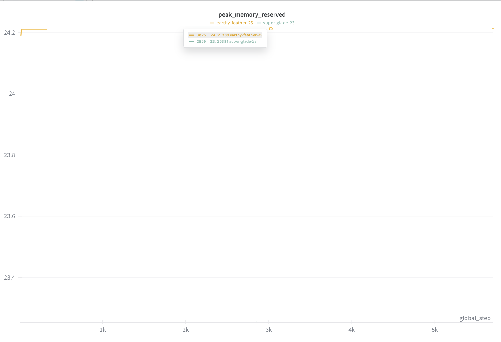

# Fine-tuning Llama 3.2 11B Vision for Structured Data Extraction

This recipe demonstrates how to fine-tune Llama 3.2 11B Vision model on a synthetic W-2 tax form dataset for structured data extraction. The tutorial compares LoRA (Low-Rank Adaptation) and full parameter fine-tuning approaches, evaluating their trade-offs in terms of accuracy, memory consumption, and computational requirements.

## Objectives
- Showcase how to fine-tune and evaluate on a specific extraction use case
- Demonstrate custom benchmarking for structured output tasks
- Compare trade-offs between LoRA and Full Parameter Fine-tuning on both task-specific and general benchmarks
- Provide guidance on data preparation, training configuration, and evaluation methodologies

## Summary

  This tutorial lays out the end to end process of preparing a sample dataset, benchmarking the baseline models, finetuning and re evaluating the models after the FT run. It also demonstrates that full parameter fine-tuning is both feasible and yields better results for specialized vision tasks with small datasets. In tortchune, memory optimized FPFT challenges the conventional wisdom that LoRA is always more memory efficient, given the caveat the default "full" parameters configurations are not training the decoder layers.

  > **Note:** We tested if this model would improve in other image to json extraction tasks, but we did not observe an improvement in those. Further testing is required to understand what type and diversity of data is requried to improve the performance on all json extraction tasks.

## Results

We present the results of the selected benchmarks across relevant domains. The focus was to add a new capability to the model without degrading existing ones, validated by testing tool calling, visual document and chart understanding, instruction following and general knowledge remain unchanged.

### Task-Specific Performance (W2 Extraction)

<table border="1" cellpadding="5" cellspacing="0">
<tr style="background-color: #f0f0f0;">
<th>Benchmark</th>
<th>11B bf16 (Baseline)</th>
<th>LoRA</th>
<th>FPFT</th>
<th>FPFT int4</th>

</tr>
<tr>
<td><strong>W2 extraction acc</strong></td>
<td>58</td>
<td><strong>72</strong></td>
<td><strong>98</strong></td>
<td><strong>96</strong></td>

</tr>
</table>

### General Benchmark Performance (llama-verifications)

<table border="1" cellpadding="5" cellspacing="0">
<tr style="background-color: #f0f0f0;">
<th>Benchmark</th>
<th>11B bf16 (Baseline)</th>
<th>LoRA</th>
<th>FPFT</th>
<th>FPFT int4</th>

</tr>
<tr>
<td>bfclv3</td>
<td>39.87</td>
<td>39.87</td>
<td>39.85</td>
<td>34.67</td>

</tr>
<tr>
<td>docvqa</td>
<td>86.88</td>
<td>85.08</td>
<td>86.3</td>
<td>78.95</td>

</tr>
<tr>
<td>gpqa-cot-diamond</td>
<td>27.78</td>
<td>27.78</td>
<td>26</td>
<td>28</td>

</tr>
<tr>
<td>ifeval</td>
<td>74.79</td>
<td>74.78</td>
<td>74.54</td>
<td>74.42</td>

</tr>
<tr>
<td>mmlu-pro-cot</td>
<td>48.43</td>
<td>48.13</td>
<td>48.33</td>
<td>46.14</td>

</tr>
</table>

### LM Evaluation Harness Results

<table border="1" cellpadding="5" cellspacing="0">
<tr style="background-color: #f0f0f0;">
<th>Benchmark</th>
<th>11B bf16 (Baseline)</th>
<th>FPFT</th>

</tr>
<tr>
<td>gsm8k_cot_llama_strict</td>
<td>85.29</td>
<td>85.29</td>

</tr>
<tr>
<td>gsm8k_cot_llama_flexible</td>
<td>85.44</td>
<td>85.44</td>

</tr>
<tr>
<td>chartqa llama exact</td>
<td>0</td>
<td>0</td>

</tr>
<tr>
<td>chartqa llama relaxed</td>
<td>34.16</td>
<td>35.58</td>

</tr>
<tr>
<td>chartqa llama anywhere</td>
<td>43.53</td>
<td>46.52</td>

</tr>
</table>

## Prerequisites
- CUDA-compatible GPU with at least 40GB VRAM
- HuggingFace account with access to Llama models
- Python 3.10+

## Setup

### Environment Creation
```bash
git clone git@github.com:meta-llama/llama-cookbook.git
cd llama-cookbook/getting-started/finetuning/vision
conda create -n image-ft python=3.12 -y
conda activate image-ft
```

### Dependencies Installation
```bash
pip install torchtune torch torchvision torchaudio torchao bitsandbytes transformers==4.51.1 accelerate vllm==0.9.2 lm_eval wandb
```

Install torchtune nightly for the latest vision model support:
```bash
pip install --pre --upgrade torchtune --extra-index-url https://download.pytorch.org/whl/nightly/cpu
```

**Important**: Log in to your HuggingFace account to download the model and datasets:
```bash
huggingface-cli login
```

## Dataset Preparation

The dataset contains 2,000 examples of synthetic W-2 forms with three splits: train (1,800), test (100), and validation (100). For this use case, we found that fewer training examples (30% train, 70% test) provided sufficient improvement while allowing for more comprehensive evaluation.

The preparation script:
1. Reshuffles the train/test splits according to the specified ratio
2. Removes unnecessary JSON structure wrappers from ground truth
3. Adds standardized prompts for training

```bash
python prepare_w2_dataset.py --train-ratio 0.3
```

This creates a new dataset directory: `fake_w2_us_tax_form_dataset_train30_test70`

> **Note**: If you change the train ratio, update the `dataset.data_files.train` path in the corresponding YAML configuration files.

## Model Download

Download the base Llama 3.2 11B Vision model:
```bash
tune download meta-llama/Llama-3.2-11B-Vision-Instruct --output-dir Llama-3.2-11B-Vision-Instruct
```

This downloads to the expected directory structure used in the provided YAML files. If you change the directory, update these keys in the configuration files:
- `checkpointer.checkpoint_dir`
- `tokenizer.path`

## Baseline Evaluation

Before fine-tuning, establish a baseline by evaluating the pre-trained model on the test set.

### Start vLLM Server

```bash
python -m vllm.entrypoints.openai.api_server --model Llama-3.2-11B-Vision-Instruct/ --port 8001 --max-model-len 9000 --max-num-seqs 100 --served-model-name 11B-base


```

For multi-GPU setup:
```bash
CUDA_VISIBLE_DEVICES="0,1" python -m vllm.entrypoints.openai.api_server --model Llama-3.2-11B-Vision-Instruct/ --port 8001 --max-model-len 9000 --tensor-parallel-size 2 --max-num-seqs 100 --served-model-name 11B-base
```

### Run Baseline Evaluation
```bash
python evaluate.py --server_url http://localhost:8001/v1 --model 11B-base --structured --dataset fake_w2_us_tax_form_dataset_train30_test70/test --limit 100 --max_workers 25
```

This will give an accuracy result around 58%, as shown in the table in the top.
> **Note:** Modify the `max-model-len` and `max-num-seqs` to fit your hardware. Specially `max-num-seqs` as vllm will OOM if not set with Llama 3.2 multimodal models.

### Cloud Evaluation Setup

To evaluate bigger models, like Llama 4 Maverick, we leverage cloud providers that server these models, like together.ai. Any OpenAI compatible provider should work out of the box with our evaluation script, as it uses the OpenAI SDK.

```bash
TOGETHER_API_KEY=<your_api_key> python evaluate.py --server_url https://api.together.xyz/v1 --model meta-llama/Llama-4-Maverick-17B-128E-Instruct-FP8  --structured --dataset fake_w2_us_tax_form_dataset_train30_test70/test --limit 100 --max_workers 25
```

The value from Maverick in our testing was around 67% accuracy out of the box.

## Fine-tuning

### Configuration Overview

The repository includes two pre-configured YAML files:
- `11B_full_w2.yaml`: Full parameter fine-tuning configuration
- `11B_lora_w2.yaml`: LoRA fine-tuning configuration

Key differences:

**Full Parameter Fine-tuning:**
- Trains encoder and fusion layers, leaving decoder frozen
- Better performance on the target use case
- Learning rate: 2e-5
- Optimizer: PagedAdamW8bit for memory efficiency

**LoRA Fine-tuning:**
- Only trains low-rank adapters across enconder and fusion layers only as well. Decoder is frozen.
- Learning rate: 1e-4
- LoRA rank: 8, alpha: 16
- Frozen decoder with LoRA on encoder and fusion layers


In our case, using torchtune, there was no significant memory gains to be had when using Lora. The footprint on the GPU was below 24GB for `batch_size: 1`, `compile: true`, `optimizer_in_bwd: True` and `gradient_accumulation_steps: 1`. Training time for 5 epochs on a single H100 was around 40 minutes.
### WandB Configuration

Before training, update the WandB entity in your YAML files and make sure you are logged in to your account:
```yaml
metric_logger:
  _component_: torchtune.training.metric_logging.WandBLogger
  project: llama3_2_w2_extraction
  entity: <your_wandb_entity>  # Update this
```

### Training Commands

**Full Parameter Fine-tuning:**
```bash
tune run full_finetune_single_device --config 11B_full_w2.yaml
```

**LoRA Fine-tuning:**
```bash
tune run lora_finetune_single_device --config 11B_lora_w2.yaml
```

This will create models in different `output_dir` for each configuration, used further down for the evaluation commands.

> **Note**: The VQA dataset component in torchtune is pre-configured to handle the multimodal format, eliminating the need for custom preprocessors. The `prepare_w2_dataset.py` script adapts the input to this format on the prompt.

## Model Evaluation

### Local Evaluation Setup

Start a vLLM server with your fine-tuned model:

**For LoRA model:**
```bash
python -m vllm.entrypoints.openai.api_server --model ./outputs/Llama-3.2-11B-Instruct-w2-lora/epoch_4/ --port 8001 --max-model-len 9000  --max-num-seqs 100 --served-model-name 11B-lora
```

**For full fine-tuned model:**
```bash
python -m vllm.entrypoints.openai.api_server --model ./outputs/Llama-3.2-11B-Instruct-w2-full/epoch_4/ --port 8001 --max-model-len 9000 --max-num-seqs 100 --served-model-name 11B-full
```

### Task-Specific Evaluation
```bash
python evaluate.py --server_url http://localhost:8001/v1 --model 11B-full --structured --dataset fake_w2_us_tax_form_dataset_train30_test70/test --limit 100 --max_workers 25
```


### General Benchmark Evaluation

Install llama-verifications for standard benchmarks:
```bash
pip install llama-verifications
```

Run benchmark evaluation:
```bash
uvx llama-verifications run-benchmarks \
    --benchmarks mmlu-pro-cot,gpqa-cot-diamond,bfclv3,docvqa \
    --provider http://localhost:8001/v1 \
    --model <model_served_name> \
    --continue-on-failure \
    --max-parallel-generations 100
```

### LM Evaluation Harness

For additional benchmarks using lm-eval:

**With vLLM backend:**
```bash
CUDA_VISIBLE_DEVICES=0,1 lm_eval --model vllm \
    --model_args pretrained=<model_path>,tensor_parallel_size=2,dtype=auto,gpu_memory_utilization=0.9 \
    --tasks gsm8k_cot_llama \
    --batch_size auto \
    --seed 4242
```

**With transformers backend:**
```bash
CUDA_VISIBLE_DEVICES=0,1,2,3 accelerate launch -m lm_eval --model hf-multimodal \
    --model_args pretrained=<model_path> \
    --tasks chartqa_llama_90 \
    --batch_size 16 \
    --seed 4242 \
    --log_samples \
    --output_path results

```

## Performance

### Peak memory



### Loss curve graph


## References

- [Torchtune Documentation](https://pytorch.org/torchtune/)
- [vLLM Documentation](https://vllm.readthedocs.io/)
- [LM Evaluation Harness](https://github.com/EleutherAI/lm-evaluation-harness)
- [Synthetic Data Kit](https://github.com/meta-llama/synthetic-data-kit)
